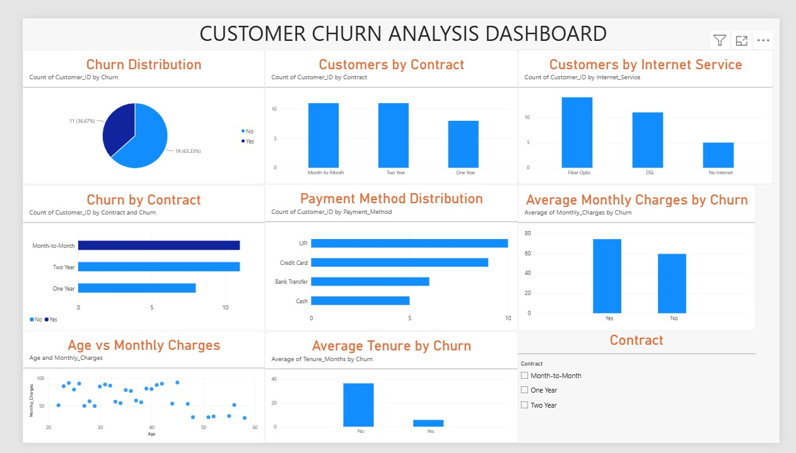

# 📊 Customer Churn Analysis – Power BI Dashboard

## 📌 Project Overview

This project analyzes customer churn using Microsoft Power BI. The dashboard provides insights into customer contracts, internet services, payment methods, monthly charges, age, and customer tenure.

## 🎯 Business Objective

The objective of this project is to understand customer churn patterns and identify factors that may contribute to customer attrition. These insights can help businesses improve customer retention strategies.

## 🛠️ Tools & Technologies

- Power BI
- Python
- SQL
- CSV Dataset
- Data Visualization
- Exploratory Data Analysis (EDA)

## 📊 Dashboard

## 📈 Dashboard Visualizations

1. Churn Distribution
2. Customers by Contract
3. Churn by Contract
4. Customers by Internet Service
5. Payment Method Distribution
6. Average Monthly Charges by Churn
7. Age vs Monthly Charges
8. Average Tenure by Churn
9. Contract Slicer for interactive filtering

## 🔍 Key Insights

- 19 customers have not churned, while 11 customers have churned.
- Month-to-Month contracts have the highest number of churned customers.
- Churned customers have higher average monthly charges (₹74.19) compared with non-churned customers (₹59.40).
- Churned customers have significantly lower average tenure (5.64 months) compared with non-churned customers (36.21 months).
- Fiber Optic is the most common internet service.
- UPI is the most commonly used payment method.

## 💡 Business Conclusion

The analysis indicates that customers with Month-to-Month contracts, higher monthly charges, and shorter tenure are more associated with churn.

Businesses can use these insights to focus on early-stage customers, improve customer value, and encourage customers to move toward longer-term contracts.

## 📂 Project Files

| File | Description |
|---|---|
| `customer-churn-analysis-powerbi.pbix` | Power BI dashboard |
| `customer_churn_dataset.csv` | Dataset used for analysis |
| `Customer_Churn_Dashboard.jpeg` | Dashboard screenshot |
| `README.md` | Project documentation |

## 👨‍💻 Author

### G. Ravi

**Data Analyst | Python | SQL | Power BI | Excel | EDA**

---

⭐ If you found this project useful, feel free to explore the repository.
